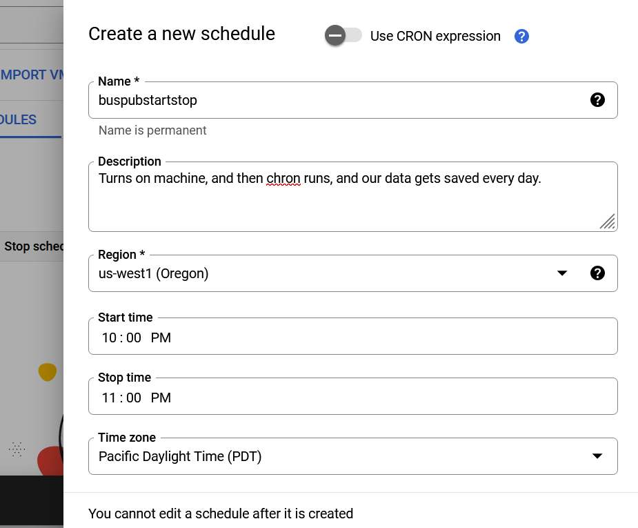

## BREADCRUMBS: TRIMET-A WINDY TRAIL

On a high level, the following are the goals for this portion of the project.  Trimet (Portland's public bus transit system)  publishes raw data regarding the location of buses throughout the day.  A simple web server provides access to one day's worth of trimet data called 'breadcrumb'. (leaving a trail)  You may access the data by using the following url
```
https://busdata.cs.pdx.edu/api/getBreadCrumbs?vehicle_id=<vehicle_id>

```

The vehicle id is assigned to each group of students and is found <here>(ADDLINK)   Replace <vehicle id>  with the correct id of the vehicle. You must get data for each vehicle assigned to the group.

#### REQUIREMENTS

    1. Create, configure and use a Google Cloud Platform (GCP) linux virtual machine (VM).
    2. Develop a simple python program to gather the data programmatically.
    3. Configure your VM running your gathering client to run daily. 
    4. Allocate and configure a message passing “topic” and “subscription” at Google Cloud Pub/Sub.
    5. Enhance your data gathering client to parse the breadcrumb data and publish individual JSON records. 

#### HOW DO YOU START?

##### GCP VM:  Create, configure, and use a Google Cloud Platform linux VM.
There are two methods to make a VM on google cloud platform(GCP).  Both methods were taken directly from Dr. Wu-Chang(1).  One way is to do it at the command line(eg: cloudshell in GCP):

```
bash
gcloud compute instances create course-vm \
  --image-family=ubuntu-2204-lts \
  --image-project=ubuntu-os-cloud \
  --boot-disk-size=20G \
  --zone=us-west1-b \
  --machine-type=e2-medium
```

The second way it to use the GCP gui(the web console on GCP). Here are the steps to do that:  Click on the 'create instance' button.  Use the defaults generally, but change the type to 'e2-medium' and use the region: "us-west 1-b'.  When the machine spins up, click on the 'SSH' button.  Run: 
```
bash
sudo apt update
sudo apt upgrade -y
```

Then you may have to install curl.
run: 
```
bash
curl --version
```
If it returns a version, then your are good, otherwise run "sudo apt install curl".
Check to see if you have access to the trimet server:
```
bash
curl -L https://busdata.cs.pdx.edu/api/getBreadCrumbs?vehicle_id=<vehicle_id> --output <output_file_name>

```

You should see the data from your vehicle(vehicle_id) in the output file.


##### Develop a simple python program to gather the data programmatically. 
 The data will probably be a bunch of data.  You will have to parse out the relevant data, grab the correct data, and then in a for-loop apply the function that will extract the correct and verified data. In a nutshell: get the data for each vehicle:'https://busdata.cs.pdx.edu/api/getBreadCrumbs?vehicle_id=<vehicle_id>'. So figure out what is in there.  Each vehicle will have some 'extra' data in there. Add each vehicle's data to a data structure.  Loop through each vehicles, data, and make a smaller more useful structure, then loop through and grab what you want.  Make it into a chart, possibly in a Jupyter notebook.
 Idea:  Use jsonify to access data, and make a list.  The 'object' name will be vehicle_id and then one may access it's attributes like this: vehicle_id.fieldname1, and vehicle_id.fieldname2. 
Testing: Make a dummy set of data, make sure you are getting what you think. For example, if the vehicle data includes vehicleId, dest, src, timeCurrent, ETANextStop, TimeLastStopAndStopID, routeId. You might only want vehicleId and timeCurrent and TimeLastStopAndStopId, and stopInfo(array of data) First you might need to store all the data(?), and then parse out the vehicleId and TimeLastStopAndStopId and stopInfo.  Grab the busId and location and stopInfo and figure out what the stop is.  This data will probably be in JSON format, so you will have to use jsonify.
This is what the bus_dictionary will look like:
```
python
bus_dict = {'vehicleID': 'timeCurrent', 'dest': 'src', 'stopInfo.stopId': 'stopInfo.stopNextId'}
```
Something like that. Then loop through the bus_dict and get the data you want.


##### Configure your VM running your gathering client to run daily.
Use cron and figure out how to have your vm turn on at 'x' time, and run your script. See https://man7.org/linux/man-pages/man8/cron.8.html.   There is probably a cron style tool on GCP such that it may be turned on at 'x-10' time, and then run the script, and then turn off the vm.

##### Allocate and configure a message passing “topic” and “subscription” at Google Cloud Pub/Sub.
Figure out the topic and subscription.  See Wu-Chang's lecture on subscription.


#### Enhance your data gathering client to parse the breadcrumb data and publish individual JSON records.
See the description of the script above.

#### START/STOP VM

After you have a vm up and running, we want to add some automatic start/stop for the VM, and then we will use chron to schedule our jobs.

From the 'compute engine' page on GCP, you should see a tab called 'instance schedule'.   Click on that.


There will be a new window opened. Click on the 'create schedule' button.


A wizard will open up. Fill it out.


Make sure the start/stop times are generous.  It may take up to 15 minutes for the VM to turn on.
Once you have created the schedule, you just need to add your VM instance to the schedule.
So click on the schedule. You may have to refresh the page to  see it.  This windown will open.

Click on the 'add instances to schedule' button.
Choose the appropriate VM and add it to the schedule.  You will probably get this error: 

No problem.  Lets add some roles.  Search for "IAM" in the GCP search bar, open that window.
Click on the "Include Google-provided role grants" check box, otherwise this particular account wont be visible
Go to 'roles' and click on the button to create a role. I used 'start-stop-vm" as the name. A wizard will open. Fill it out and add the required permissions from the error.


Once it has been created, go back to the IAM splash page, and click on the 'pen' icon on the left of the desired account.  A new wizard will open up.  Add your newly created role.

Then go back to 'compute engine' find your schedule, and add the right VM to your schedule.  Voila!


REFERENCES:
1.  Lifted spuriously from Dr. Wu-Chang's 530 website;
https://codelabs.cs.pdx.edu/labs/C01.1_hw1/index.html?index=..%2F..cs430#2